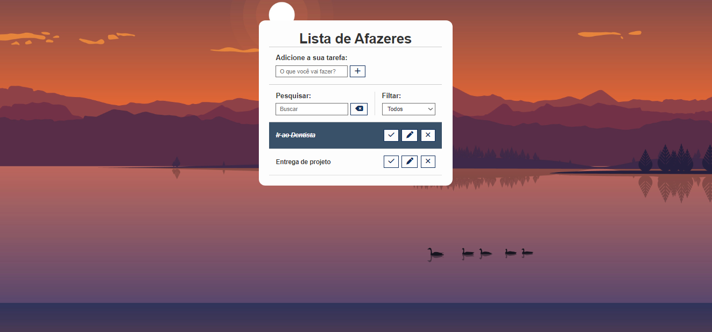

# Projeto Lista de Afazeres

# Sobre o Projeto

Projeto de uma lista de afazeres utilizando conceitos de JavaScript em conjunto com elementos de HTML e CSS para a estilização do projeto.

<h4 align="center"> 
	🚧 Finalizado 🚧
</h4>

# Índice/Sumário

* [Sobre](#sobre-o-projeto)
* [Tecnologias Usadas](#tecnologias-usadas)
* [Autores](#autores)

# Tecnologias Usadas

- [JavaScript](https://developer.mozilla.org/en-US/docs/Web/JavaScript)
- [CSS](https://www.w3.org/Style/CSS/Overview.en.html)	
- [HTML](https://html.spec.whatwg.org/multipage/)

# Autores

- [Gabriel Daisuke Matsubara - RA: 8222245563]